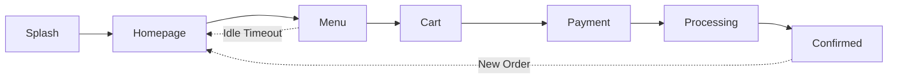

<div align="center">

# 🍗 Chicket

**Self-Service Food Ordering Kiosk**

[](https://flutter.dev)
[](https://dart.dev)
[](https://developer.android.com)
[](LICENSE)

A Flutter-based self-service kiosk application for food ordering, designed for Android kiosk devices.

---

[Features](#-features) •
[Tech Stack](#-tech-stack) •
[Getting Started](#-getting-started) •
[Deployment](#-kiosk-deployment) •
[Project Structure](#-project-structure)

</div>

---

## ✨ Features

<table>
<tr>
<td>

🛒 **Self-Service Ordering**
> Browse menu, customize items with add-ons, and place orders

🔒 **Kiosk Mode**
> Full immersive mode with locked navigation (blocks home, back, volume keys)

⏱️ **Idle Detection**
> Auto-reset to home screen after inactivity

</td>
<td>

🌐 **Multi-language Support**
> Language selector on homepage

📱 **QR Code Generation**
> Order confirmation with QR codes

💳 **Payment Selection**
> Multiple payment method options

💡 **Wake Lock**
> Screen stays on continuously for kiosk use

</td>
</tr>
</table>

---

## 🛠 Tech Stack

| Category | Technology |
|----------|------------|
| **Framework** | Flutter 3.10+ |
| **State Management** | GetX |
| **Navigation** | GetX Routes |
| **UI Scaling** | flutter_screenutil (1080x1920) |
| **Assets** | flutter_gen (type-safe) |
| **Images** | flutter_svg, cached_network_image |
| **QR Codes** | qr_flutter |
| **Screen** | wakelock_plus |

---

## 🚀 Getting Started

### Prerequisites

```
✅ Flutter SDK ^3.10.8
✅ Android SDK
✅ ADB (for kiosk deployment)
```

### Installation

```bash
# Clone the repository
git clone <repository-url>
cd chicket_flutter

# Install dependencies
flutter pub get

# Generate assets
dart run build_runner build

# Run in debug mode
flutter run
```

### Build Release

```bash
flutter build apk --release
```

> 📦 Output: `build/app/outputs/flutter-apk/app-release.apk`

---

## 📲 Kiosk Deployment

The project includes batch scripts for deploying to Android kiosk devices:

| Script | Description |
|--------|-------------|
| 🔧 `kiosk_setup.bat` | Full device setup (factory reset device required) |
| 🔄 `kiosk_reset.bat` | Reset kiosk configuration |
| 🔍 `kiosk_diagnostics.bat` | Debug and diagnose kiosk issues |

### Requirements

> ⚠️ **Important**: Device must be factory reset with no accounts added

- ✅ USB debugging enabled
- ✅ Device connected via USB
- ✅ ADB installed and in PATH

### Setup Process

```bash
kiosk_setup.bat
```

<details>
<summary>📋 What the setup does</summary>

1. Install the APK
2. Set as device owner
3. Enable kiosk lock task mode
4. Configure auto-start on boot
5. Hide system UI and navigation

</details>

---

## 🗺 App Flow



---

## 📁 Project Structure

```
lib/
├── 📄 main.dart              # App entry point
├── 📄 init.dart              # Controller initialization
├── 📄 routes.dart            # GetX route definitions
├── 📄 constants.dart         # App constants
│
├── 📂 controllers/           # GetX controllers
│   ├── idle_controller.dart
│   └── order_controller.dart
│
├── 📂 models/                # Data models
│   └── menu_model.dart
│
├── 📂 theme/                 # App theming
│   └── colors.dart
│
├── 📂 utils/                 # Utilities
│   ├── kiosk_service.dart
│   └── color_filter.dart
│
├── 📂 views/                 # UI screens
│   ├── splash/
│   ├── homepage/
│   ├── menu/
│   ├── cart/
│   ├── select_payment/
│   ├── order_processing/
│   ├── confirmed/
│   └── mob/
│
└── 📂 gen/                   # Generated assets
```

---

## ⚙️ Configuration

| Setting | Value |
|---------|-------|
| **Design Size** | 1080 x 1920 (portrait) |
| **Package Name** | `com.diode.chicket` |
| **Min SDK** | Android 5.0+ |

---

<div align="center">

## 📄 License

**Proprietary** - © Diode

---

Made with ❤️ and Flutter

</div>
